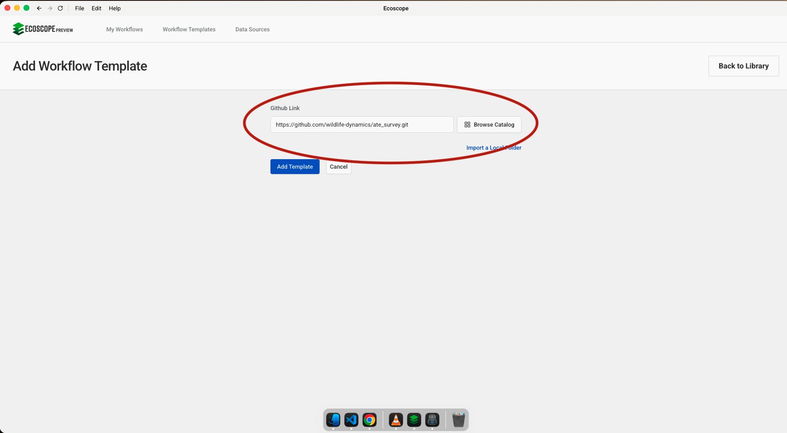
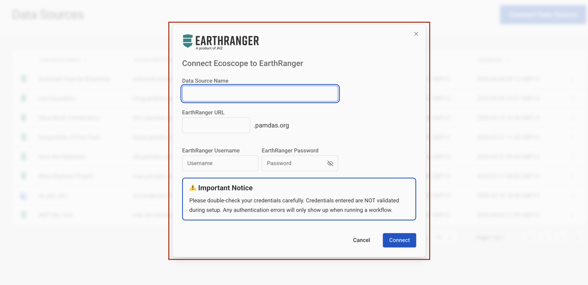
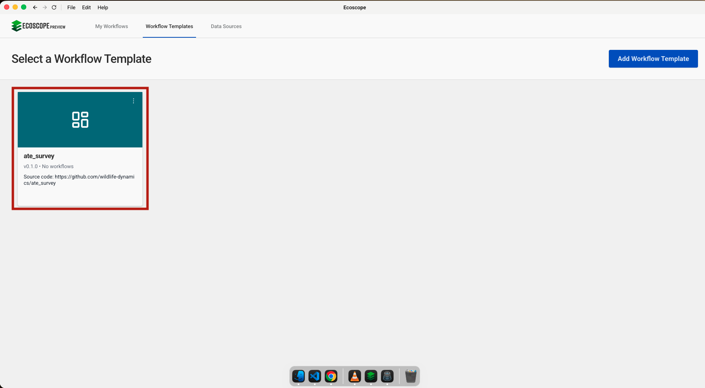
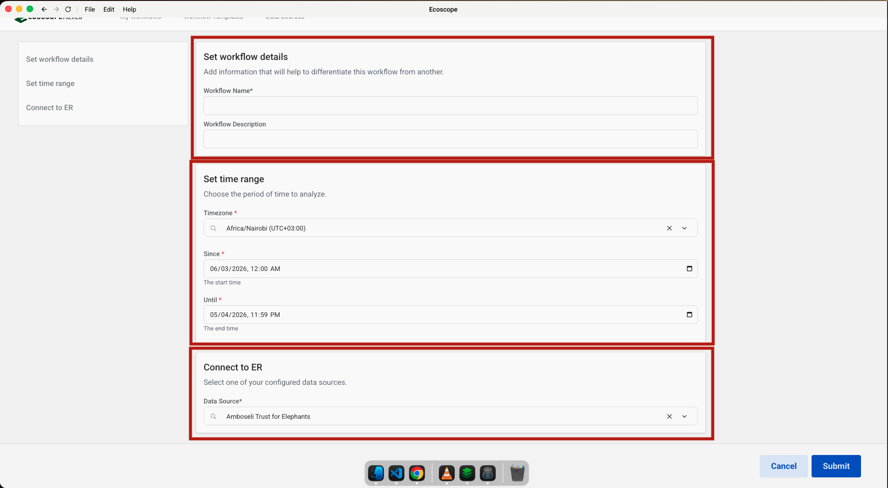

# ATE Survey — User Guide

This guide walks you through configuring and running the ATE Survey workflow, which processes Amboseli Trust for Elephants community questionnaire responses to produce attitude charts, sentiment scores, statistical analyses, spatial maps, and a Word report.

---

## Overview

The workflow delivers, for each run:

- **2 Likert charts** — community attitudes/beliefs (agree/disagree) and mitigation effectiveness ratings
- **26 pie charts** and **9 bar charts** across demographic, knowledge, and behaviour questions
- **Elephant sentiment scores** — a per-respondent overall attitude score computed from 11 belief columns
- **ANOVA, boxplots, OLS scatter plots, and Tukey HSD plots** — statistical analysis of sentiment vs demographic factors
- **3 spatial maps** — survey locations, gender distribution, and attitude scores overlaid on Amboseli ranch boundaries
- **1 Word report** (`social_survey.docx`) populated with all charts and a demographic summary table

---

## Prerequisites

Before running the workflow, ensure you have:

- Access to an **EarthRanger** instance with `atequestionnaire_rep` events recorded for the analysis period

---

## Step-by-Step Configuration

### Step 1 — Add the Workflow Template

In the workflow runner, go to **Workflow Templates** and click **Add Workflow Template**. Paste the GitHub repository URL into the **Github Link** field:

```
https://github.com/wildlife-dynamics/ate_survey.git
```

Then click **Add Template**.



---

### Step 2 — Add an EarthRanger Connection

Navigate to **Data Sources** and click **Connect**, then select **EarthRanger**. Fill in the connection form:

- **Data Source Name** — a label to identify this connection (e.g. `Amboseli Trust for Elephants`)
- **EarthRanger URL** — your instance URL (e.g. `your-site.pamdas.org`)
- **EarthRanger Username** and **EarthRanger Password**

> Credentials are not validated at setup time. Any authentication errors will appear when the workflow runs.

Click **Connect** to save.



---

### Step 3 — Select the Workflow

After the template is added, it appears in the **Workflow Templates** list as **ate_survey**. Click the card to open the workflow configuration form.



---

### Steps 4–6 — Set Workflow Details, Time Range, and Connect to EarthRanger

The configuration form has three sections, all visible on a single page.

**Step 4 — Set workflow details**

| Field | Description |
|-------|-------------|
| Workflow Name | A short name to identify this run |
| Workflow Description | Optional notes (e.g. survey period or site) |

**Step 5 — Set time range**

| Field | Description |
|-------|-------------|
| Timezone | Select the local timezone (e.g. `Africa/Nairobi UTC+03:00`) |
| Since | Start date and time — all `atequestionnaire_rep` events from this point are fetched |
| Until | End date and time of the analysis window |

**Step 6 — Connect to ER**

Select the EarthRanger data source configured in Step 2 from the **Data Source** dropdown (e.g. `Amboseli Trust for Elephants`).

Once all three sections are filled, click **Submit**.



---

## Running the Workflow

Once submitted, the runner will:

1. Fetch `atequestionnaire_rep` events for the analysis period; exclude invalid records; flatten and rename survey columns.
2. Fill missing values; map response strings to display labels (Agree/Disagree, True/False, Effective/Not effective).
3. Bin continuous columns into 5 equal-width bins; produce a demographic summary table.
4. Generate 2 Likert charts, 26 pie charts, and 9 bar charts.
5. Compute per-respondent elephant sentiment scores from 11 attitude columns.
6. Run Type II ANOVA, boxplots, OLS scatter plots, and Tukey HSD post-hoc plots.
7. Download spatial layers from Dropbox (ranch boundaries, swamps, national parks) and render 3 EcoMaps.
8. Download the Word template from Dropbox; populate it with all charts and the demographic table; save as `social_survey.docx`.
9. Save all outputs to the directory specified by `ECOSCOPE_WORKFLOWS_RESULTS`.

---

## Output Files

All outputs are written to `$ECOSCOPE_WORKFLOWS_RESULTS/`. Files marked with `<column>` are produced once per chart column.

| File | Description |
|------|-------------|
| `demographic_table.csv` | Summary table: gender, age, tribe, household size, education |
| `elephant_sentiment_scores.csv` | Per-respondent overall attitude score |
| `anova_results.csv` | Type II ANOVA: sentiment vs gender, age group, education, marital status |
| `elephants_relationship_likert.html` / `.png` | Agree/Disagree Likert chart (11 attitude columns) |
| `effectiveness_mitigation_methods.html` / `.png` | Effective/Not effective Likert chart (3 mitigation columns) |
| `<column>_pie.html` / `.png` (×26) | One pie chart per survey question |
| `<column>_bar.html` / `.png` (×9) | One bar chart per survey question |
| `<column>_boxplot.html` / `.png` (×5) | Sentiment score distribution by demographic group |
| `<column>_ols.html` / `.png` (×2) | OLS regression: age and household size vs sentiment |
| `<column>_tukey.html` / `.png` (×4) | Tukey HSD post-hoc comparison per demographic factor |
| `survey_locations_ecomap.html` / `.png` | All survey point locations on Amboseli base map |
| `gender_distribution_ecomap.html` / `.png` | Survey points coloured by respondent gender |
| `attitude_scores_community.html` / `.png` | Survey points coloured by overall attitude score |
| `social_survey.docx` | Final Word report with all charts and demographic table |
